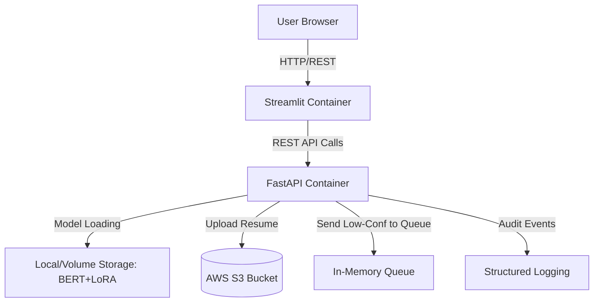

# System Architecture

This document describes the architectural design of the AI Resume Information Extraction System, emphasizing cloud readiness, scalability, and maintainability.

## 1. High-Level Architecture
The system follows a classic decoupled client-server architecture, fully containerized using Docker.

## 2. Component Details

### Frontend (Streamlit)
- **Role:** Provides the UI for uploading resumes, viewing extracted entities, and managing the human review queue.
- **Why Streamlit?** Fast prototyping for data applications, allowing rapid iteration on UI without complex React/Vue setups.

### Backend (FastAPI)
- **Role:** Handles incoming HTTP requests, orchestrates model inference, applies business logic (confidence routing), and integrates with AWS.
- **Why FastAPI?** High performance (built on Starlette), native async support, and automatic OpenAPI documentation generation.

### AI Inference Engine
- **Base Model:** `dslim/bert-base-NER`
- **Adapter:** LoRA weights (`adapter_model.safetensors`).
- **Optimization:** Loaded globally at API startup using FastAPI's `@asynccontextmanager lifespan`. Inference utilizes Test-Time Augmentation (TTA).

### Storage & External Services
- **AWS S3:** Acts as the primary object store for user-uploaded PDFs, ensuring durability and preventing local disk saturation.
- **Review Queue:** An internal queue mechanism to handle low-confidence Extractions (Confidence < 60%).

## 3. Production & Scalability Considerations

### A. Current Implementation
The current implementation runs as a monolithic container setup. It is suitable for low-to-medium traffic and serves as an excellent demonstration of the ML pipeline.

### B. Future Cloud Scalability
To support enterprise-grade traffic, the architecture should evolve:
1. **Load Balancing:** Deploy an AWS Application Load Balancer (ALB) in front of an ECS cluster running the FastAPI backend.
2. **Asynchronous Workers:** Move inference out of the synchronous HTTP request cycle. 
   - Backend uploads file to S3 and publishes a message to **AWS SQS**.
   - A separate pool of **GPU Worker Instances** pulls from SQS, processes the CV, and saves the result to a database (e.g., PostgreSQL or DynamoDB).
3. **Monitoring:** Integrate `watchtower` to ship structured logs directly to AWS CloudWatch for real-time alerting.
